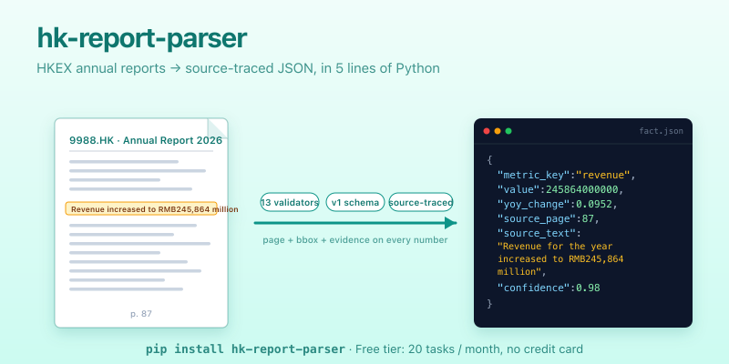

<!-- prettier-ignore -->
<p align="center">
  
</p>

<h1 align="center">hkfilings</h1>

<p align="center">
  <b>Turn Hong Kong listed-company annual & interim report PDFs into source-traced<br>
  financial facts, industry signals and supply-chain graphs — in 5 lines of Python.</b>
</p>

<p align="center">
  <a href="https://pypi.org/project/hkfilings/"></a>
  <a href="https://pypi.org/project/hkfilings/"></a>
  <a href="LICENSE"></a>
  <a href="https://github.com/mylovelycodes/hkfilings-python/actions"></a>
  <a href="https://pepy.tech/project/hkfilings"></a>
</p>

<p align="center">
  <b>English</b> · <a href="README.zh-CN.md">中文</a>
</p>

---

## Why this exists

If you've ever tried to extract revenue, segment breakdowns or capex
guidance from a 300-page HKEX PDF, you know the failure modes: numbers
without page references, OCR drift, units mixed between HKD and RMB,
hallucinated year-over-year changes that don't reconcile, segment totals
that don't sum to the consolidated figure.

This SDK is a client for an API that returns every fact with:

- **`source_page` + `bbox`** — point at the exact location in the PDF
- **13 deterministic validators** — YoY recalc, accounting equation,
  segment reconciliation, currency / unit consistency, cashflow sign
  checks, EPS sign, free-cashflow definition, …
- **A frozen v1 schema** — new backend fields land in an `extra` dict;
  your code never breaks on a release
- **Layer-2 signals** — 11 enumerated signal types (margin driver,
  upstream cost pressure, downstream demand, inventory & orderbook,
  capex, …), each bound to evidence with anti-hallucination rules
- **Supply-chain graph** — suppliers, customers, competitors,
  regulators, substitutes — with exposure share and direction

## Install

```bash
pip install hkfilings
```

Requires Python ≥ 3.10. The only dependency is `httpx`.

## Quickstart

```python
from hkfilings import HKFilingsClient

# Free tier: 20 tasks/month, no credit card → https://hkfilings.app/signup
client = HKFilingsClient(api_key="ak_...")

task   = client.analyze(ticker="9988", year=2026)   # Alibaba 9988.HK
report = client.wait(task.task_id, timeout=600)

for fact in report.facts:
    print(f"{fact.metric_key:32}  {fact.value!s:>16}  p.{fact.source_page}")
```

> Free tier: 20 tasks per month, no credit card.
> → **Get a key:** https://hkfilings.app/signup

## What you get back

Every fact carries its provenance:

```python
fact.metric_key       # "revenue"
fact.value            # 245_864_000_000.0
fact.comparable_value # 224_500_000_000.0  (prior period)
fact.yoy_change       # 0.0952
fact.source_page      # 87
fact.source_text      # "Revenue for the year increased to RMB245,864..."
fact.confidence       # 0.98
fact.extra            # forward-compat fields land here
```

## Cookbook

### Compare gross margin: BABA vs Tencent, last 3 fiscal years

```python
from hkfilings import HKFilingsClient
import pandas as pd

client = HKFilingsClient(api_key="ak_...")
rows = []
for tk in ("9988", "0700"):
    m = client.company_matrix(tk, metrics=["revenue", "gross_profit"])
    rows.extend({"ticker": tk, **cell} for cell in m.cells)

df = pd.DataFrame(rows).pivot_table(
    index="period", columns=["ticker", "metric_key"], values="value"
)
print(df)
```

### Read industry signals + evidence

```python
sigs = client.task_signals(task.task_id, signal_type="margin_driver")
for s in sigs.signals:
    print(f"[{s.direction:>8}] {s.summary}")
    for ev in s.evidence:
        print(f"            p.{ev.get('page')} — {ev.get('text')[:80]}")
```

### Render the supply-chain graph

```python
import networkx as nx

graph = nx.DiGraph()
sc = client.company_supply_chain("9988")
for node in sc.nodes:
    graph.add_edge("9988", node.node_label,
                   role=node.node_role, exposure=node.exposure_share)
print(nx.info(graph))
```

### Export to CSV for Excel

```python
with open("baba_2026_facts.csv", "wb") as fh:
    fh.write(client.facts_csv(task.task_id))
```

More runnable examples in [`examples/`](examples/).

## API reference

| Method | What it does |
| ------ | ------------ |
| `analyze(ticker, year, …)` | Auto-discover and parse a report by ticker + year |
| `create_task(pdf_url, …)` | Parse a PDF by URL |
| `upload(file_path, …)` | Upload a local PDF |
| `task_status(task_id)` | Poll task progress |
| `wait(task_id, timeout=600)` | Block until the task reaches a terminal state |
| `result(task_id)` | Return the Layer-1 financial-facts envelope |
| `facts_csv(task_id)` | Same data, as CSV bytes |
| `company_matrix(ticker, metrics=…)` | Cross-period matrix for a ticker |
| `task_signals(task_id, …)` | Layer-2 signals for one report |
| `company_signals(ticker, …)` | Cross-period signal feed |
| `task_supply_chain(task_id)` | Supply-chain nodes for one report |
| `company_supply_chain(ticker, …)` | Cross-period supply-chain feed |
| `task_catalysts(task_id)` | Forward-looking catalysts (1–4Q horizon) |
| `company_catalysts(ticker, …)` | Cross-period catalyst feed |
| `intelligence_brief(task_id)` | Executive brief (rich nested) |
| `review_diff(task_id, …)` | Diff between review versions |
| `patch_fact(fact_id, **fields)` | Update a fact (review action) |
| `patch_signal(signal_id, **fields)` | Update a signal (review action) |
| `fact_comment(fact_id, body, …)` | Attach a review comment |
| `schema(name="financial_fact")` | Fetch a JSON Schema document |

Full docs: https://docs.hkfilings.app/python

## Plans & limits

The SDK is free under MIT. The managed API runs on a usage-based plan:

| Plan | Tasks / month | Layer-2 access | Export | Price |
| ---- | ------------- | -------------- | ------ | ----- |
| Free | 20 | Limited | JSON / CSV (watermark) | $0 |
| Pro | 200 | Full | JSON / CSV | See pricing |
| Team | 1,000 | Full + multi-seat | JSON / CSV / MD | See pricing |
| Enterprise | Custom | Full + webhooks + SLA | Custom | Talk to us |

→ Compare and upgrade: https://hkfilings.app/pricing

You can also self-host the parsing service if you have your own LLM
budget — set `base_url="https://your-host"` when constructing the
client. Get in touch (sales@hkfilings.app) for on-prem deployments.

## Schema contract

The v1 public schema is frozen. JSON Schema documents:

- https://api.hkfilings.app/v1/schema/financial_fact
- https://api.hkfilings.app/v1/schema/industry_signal
- https://api.hkfilings.app/v1/schema/supply_chain_node
- https://api.hkfilings.app/v1/schema/catalyst

New backend fields land in each dataclass's `extra` dict — you do not
need to upgrade the SDK to see them. We never remove or rename a
documented field within v1.

## Configuration

| Setting | Constructor arg | Env var |
| ------- | --------------- | ------- |
| API base URL | `base_url=` | `HKFILINGS_BASE_URL` |
| API key | `api_key=` | `HKFILINGS_API_KEY` |
| Request timeout (s) | `timeout=60.0` | — |
| User-Agent | `user_agent=` | — |

The client honors `HTTPS_PROXY` / `HTTP_PROXY` via httpx — useful behind
corporate firewalls.

## Roadmap

- **v0.2** — Async client (`HKFilingsAsyncClient`), retry with
  exponential backoff, `client.facts_to_dataframe()` helper.
- **v0.3** — Streaming task events (SSE wrapper), webhook signature
  helpers, CLI (`hkfilings analyze 9988 2026`).
- **v1.0** — Stable surface, deprecation warnings removed, TypeScript
  SDK companion.

Open issues for what you'd like prioritized.

## FAQ

**Q: Can I self-host the parsing engine?**
A: Yes for Enterprise customers — contact sales@hkfilings.app. The
parsing service requires an LLM API key (DeepSeek, OpenAI, or
Anthropic) and a Postgres database.

**Q: How is this different from Wind / Bloomberg / Capital IQ?**
A: We focus on Hong Kong listings only and ship the entire evidence
chain (source page + text + bbox) alongside every number. Our schema
is public and frozen; theirs are proprietary and shift between
releases. We're priced for individuals and small funds.

**Q: A-shares? US listings?**
A: Not yet. We may add them once the HK coverage is rock-solid.

**Q: Is the parsing logic open-source?**
A: This SDK is open-source under MIT. The parsing engine — LLM
prompts, validators, anti-hallucination rules — is closed-source. We
publish the JSON Schema contract as a stability commitment.

**Q: How do I report a parsing bug for a specific report?**
A: Open a GitHub issue with the `task_id`. We'll triage on the SaaS
side and either fix the engine or update the report.

**Q: I got rate-limited. What now?**
A: Free tier is 20 tasks/month. Upgrade or wait for the next monthly
reset. `HKFilingsError` will include `status_code=429` and
`payload["upgrade_url"]`.

## Acknowledgements

Built with [`httpx`](https://www.python-httpx.org/). Client ergonomics
inspired by the `openai-python` and `anthropic-python` SDKs.

## License

[MIT](LICENSE). See [SECURITY.md](SECURITY.md) for vulnerability
reporting, [CONTRIBUTING.md](CONTRIBUTING.md) to help out.

---

<p align="center">
  Made with care for HK equity research. Get a free key →
  <a href="https://hkfilings.app/signup"><b>hkfilings.app/signup</b></a>
</p>
